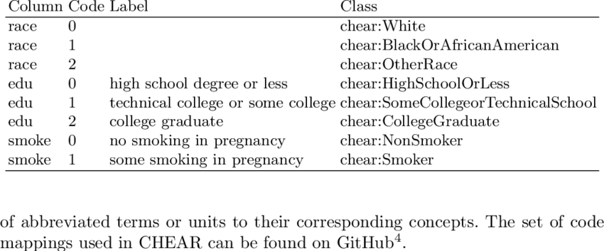

```{r, echo=FALSE}
library(knitr)
```


# Overview

This workshop covers best practices for organizing and documenting your digital projects for robust, reproducible research. Topics covered will include data documentation, forms of metadata at both the data and project level, and best practices for organizing file directories and recording metadata. After this workshop learners will be able to create a readme for their data-driven project directory, design a data dictionary (or codebook) for a dataset, and describe how to use a workflow diagram to represent their data gathering, cleaning, and analyses methodology. This workshop will include a studio portion where learners are guided through putting the principles into practice to begin documenting their own research projects. 

## Learning Objectives

After this workshop, learners should be able to: 

* Define metadata 
* Understand the importance of collecting metadata / data documentation
* Recognize the different ways metadata can be recorded at the project and dataset level 
* Locate the relevant metadata standard for their field
* Produce a data dictionary / codebook for a tabular dataset 
* Document the organization of a data-driven project using a README 
* Represent how their data is processed and analyzed using a workflow diagram

# Defining Metadata 
Metadata, as its name suggests, is data about your data or information about information. More specifically, the [National Information Standards Organization](http://www.niso.org/press-releases/2004/07/niso-offers-public-free-primer-metadata#:~:text=In%20brief%2C%20the%2020%2Dpage,data%2C%20or%20information%20about%20information.) defines metadata as "structured information that describes, explains, locates, or otherwise makes it easier to retrieve, use, or manage an information resource." Whenever we **document** our processes, **describe** the contents of our datasets and variables, or **record** analysis details, we are collecting metadata. 

## Metadata in the Data Lifecycle


*(Image from [USGS](https://pubs.usgs.gov/of/2013/1265/pdf/of2013-1265.pdf) with modifications.)*

When considering our projects through the lens of [the data lifecycle](https://old.dataone.org/data-life-cycle), data documentation should ideally occur across all stages of our project. We should consider how we will collect metadata when planning out our data-driven projects, record metadata along with our actual data collection,and describe our data processing and analysis worfklows. When our project finishes, we also should include details about the long-term storage of our data, related publications, reports, or archives along with our dataset for future users.

(To learn more about the data lifecycle, see [this resource](https://ucdavisdatalab.github.io/workshop_keeping_data_tidy/#datalifecycle).)

## Why is collecting metadata important?

Detailed documentation of datasets and data analysis workflows helps other researchers, including collaborators, find and use your data easier. Strong documentation also enables reuse and reanalysis of your data, which increases research reproducibility ([NASEM 2019](https://www.ncbi.nlm.nih.gov/books/NBK547546/)).

Consistent documentation practices will also help *you* find, use and re-analyze your data in the future. Have you ever put a project on the backburner for a few months, only to return and be confused as to what was in what dataset, which dataset was up to date, or how you were analyzing this process? The diagram below illustrates how information about a dataset or project can be lost over time as researchers become less and less familiar with the inner workings of a particular project. While the figure revolves around issues across a researchers' career, information is also lost during our graduate and post-doctoral work, as we juggle different projects and lose space in our "mental storage". Keeping well-documented data and projects helps us avoid these issues. 

{width=65%}
*(from [Michener et al (1997)](https://esajournals.onlinelibrary.wiley.com/doi/10.1890/1051-0761%281997%29007%5B0330%3ANMFTES%5D2.0.CO%3B2))*

Overall, documenting your data and project consistently will help you save time and avoid headaches in your own project, but also help increase data accessibility, transparency and reproducibility in your field and research at large. 

## What should be included in metadata?
Metadata should describe who created or collected the data, what the subject of the data is, and what variables it measures and includes (this is called **descriptive metadata**) It should also cover how the datasets or projects are organized, if and how datasets relate to each other, and how they were processed or analyzed (**structural metadata**). Lastly, it should include information on that credits creators and discusses access and re-use rights (**administrative metadata**, especially important when data are shared, published or archived). 

Some questions to consider: 

* What is the file naming convention or scheme in my project directory?
* What do the values in the table refer to? 
* What units are the variables in? What possible levels can they have?
* How is missing data denoted?

* How, where and on what was this data collected? What processes were used for creating the data?
* How was the data analyzed? 
* What software do I need in order to read the data?

* Can I give these data to someone else?
* Why were the data created?
* How should the data be cited? Where can I find relevant publications?

You should be able to answer many of these questions by filling out the templates for readmes, data dictionaries. codebooks provided in this workshop. 
Many of these questions will be covered in the templates for documentation provided in this workshop. 

## Activity: What should be included in metadata?
[If the activity requires links, I will place links here. Otherwise, will remove this section.]

### Tools for planning and documenting your project 

Data documentation that accompanies your datasets and resides within your project directory, such as readmes, are important and are the main focus of this workshop. However, as you answer the above questions, you may find yourself considering decisions about how you want to organize, store and structure your data-driven project.

The **DMPtool** helps researchers create a Data Management Plan (DMP). Among the topics included in this plan are guidelines for how you will document and collect metadata in your project, as well as other questions related to structural and administrative metadata. Further, some funding agencies, like the National Science Foundation, are now requiring DMPs along with grant proposals. Creating a DMP can also signal your commitment to more open, reproducible research. DMPs can be included in study **pre-registration**, such as on the [Open Science Framework](https://help.osf.io/hc/en-us/articles/360019931133-Creating-a-data-management-plan-DMP-document), where researchers provide details as to methods, hypotheses, predictions, and data management before conducting a study. 

If you are still in the early phases of a project, it can be a great idea to create a DMP as you move forward.  Learn more about the DMPtool and DMP resources from the UC Davis Library [here](https://www.library.ucdavis.edu/service/data-management/plan-2/). 

# Levels of Metadata 
In this workshop, we will focus on documenting metadata at three levels: 

1.**Project level: File directory contents and organization** 

  * **Documentation format: README file**
    * How is your project organized in folders and files? 
    * What are the file naming conventions?
    * What is contained in each of the separate files?


2.**Data level: Variables and units** 

  * **Documentation format: Data dictionary and/or codebook**
    * What are the variables in this dataset?
    * What are the possible levels or values, and units for each variable?
    * How are missing values denoted?

3.**Project level: Workflow processes** 

  * **Documentation format: Workflow diagram**
    * How was data cleaned, processed and/or analyzed? 
    * What code or scripts were used to do this?
    * How do different datasets relate to one another?

These three topics cover aspects of descriptive metadata (1-2) at various levels, and structural metadata (3) at the project level. We go into detail on each, provide templates and examples as a starting place below. 


*Note: Although we have organized the workshop in this format, this information can be organized in a variety of ways. For instance, all of the above information could be included in text in a single readme.txt document. Specific decisions for your project will be up to you and how you plan to use your data, and you may encounter various forms of metadata "in the wild".*

## Project: File Directory Contents and Organization
At the highest level of your project is your project **directory**, or the folder(s) containing all the files of your project, from data and code to manuscript drafts.

### READMEs

A README document will describe the organization and contents of your project, and will serve as the roadmap for any user who "drops in" to your project and needs to orient themselves.

**Bare minimum information a project README should include**:

* Project title, investigator, institution and dates of project 
* Brief description of methods for data collection and generation
  * can include links to publications, protocols or other documentation with more details
* Brief description of data processing, if data are filtered or generated from the raw data 
* Brief description of what each folder and data file contains
* Date each file was created
* Overview of the file naming scheme (if present,see below)

**Best practices for README files**: 

READMEs should 

* Be written in plain-text (.txt) or markdown (.md) so they are easily accessible by anyone / non-proprietary
* Live in the main directory of the project folder or file they describe 
* Be named so that it is clear what project / file it describes
* Be formatted similarly across different projects 
* Use standardized formats, such as ISO 8601 for dates (YYYY-MM-DD) 

For more information on README contents beyond these minimum and more format recommendations, see [Cornell University's guide to writing "readme" style metadata](https://data.research.cornell.edu/content/readme). 

For some README inspiration, see these real world examples: LINKS
You'll notice substantial variation in the formats and topics included, but most include the bare minimum information for data reuse. 

### Project Directory Structure 

As you begin your README documentation, you may want to consider the organization of your project and directory. Do you have a consistent file naming convention or scheme? Is there a logical hierarchy to your folders?

**Directory structure tips**: While folder directories will very much vary with project types and researcher styles, there are some tips that may help with organization. It's best to include all files for your project in one single project folder, with subfolders. Raw,original data files can often be stored separately from processed or filtered datasets. Results or products, such as statistics or summary tables, or figures, can be stored in separate folders. Code and scripts can have their own folder, too. Whatever you choose, make sure there is some logic to the organization (this will come through when you explain it in your documentation) and that you are **consistent**. 

More "real world" examples can be found here: <mark> ADD EXAMPLES </mark>

*Note: GitHub repositories are a great place to get a sense of what the organizational norm is for your field. Often, a folder directory will become housed in a version-controlled repository, so repositories can serve as inspiration for how to structure your folder directories. For more on what a repository is and on version control with git, see <mark> LINK TO WORKSHOP </mark> *

### File Names
File names are one of the first places many of us store metadata. To better organize your project directory and document your metadata, we recommend using a consistent naming scheme. You can then record the general form of this file naming scheme in your README document, so that future users can easily navigate current files and generate new files that match the format. 

Some possible schemes:  

* `[authorLastName]_[method]_[subject]_[YYYYMMDD]_[version].[ext]`
* `[project-name]_[method]_[version]_[YYYYMMDD].[ext]`
* `[YYYYMMDD]_[version]_[subject]_[authorInitials].[ext]`
* `[file-type]_[author]_[YYYYMMDD].[ext]`

And an example file name scheme in practice, from a bioinformatics study: 


(from [Reiter et al (2021)](https://academic.oup.com/gigascience/article/10/1/giaa140/6092773?login=true))
As you can see, as file names become more complex, using a consistent scheme and documenting it is KEY to data interpretability! 

In terms of format, file names are best if they are human-readable, machine-readable, and work well with default ordering. Briefly, this means you as a user should be able to get some metadata from the file name, the file name avoids spaces and special characters, and ideally has some date or version number that can be used to sort files and versions. You can read more about these file-naming best practices [here](https://ucdavisdatalab.github.io/workshop_keeping_data_tidy/#how-to-name-your-files). 

## Datasets: Variables and Codes

At the next level, after project organization and folders, lie the details of our data / datasets. If you are working with file types such as a set of images, photos, videos, where the data lies in separate files, you may want to make a sub-folder README, where the content of the folder is described, along with the origin and subject of the files, and the file naming scheme or convention. Depending on your use and project complexity, you can also include this information in the larger, project README, though often it is best to have the README file housed closely with the files it details. 

### Data Dictionaries / Codebooks 

If you work with tabular or spreadsheet data, as many researchers do, you might need to collect metadata differently. In this case, there are arrays of variables, codes and entries that may need a key and may relate to one another. When working with this type of data, **data dictionaries and codebooks** can be useful. 

**Data dictionaries** describe the variables of the dataset and their parameters, specifically for tabular data. **Codebooks** are very similar to data dictionaries and are commonly used in survey data, and may have a slightly different format (but the difference is mainly just field nomenclature).

**Bare minimum  of what a data dictionary or codebook should include:**

* List of variables / column names and a description of what they include
* For each variable, the type (numerical? character/text?) and the units it should be entered in (e.g. meters, feet)
* For each variable, the acceptable range or list of values
* If a variable uses codes, what the codes refer to 
  * e.g. 0 = male, 1 = female; Likert scale: 5 = Strongly Agree, 4 = Agree, 3 = Neutral, 2 = Disagree, 1 = Strongly Agree. 
  * codebooks usually go into great detail into these levels for extensive surveys and demographics.
* How missing data is coded across the dataset or in specific variables 

**Best practices for data dictionaries and codebooks:**

Similarly to READMEs, data dictionaries should be: 

* Stored in open, non-proprietary formats. Data dictionaries, like the data they describe, may be easily formatted in a tabular format. Some researchers using a spreadsheet manager like Excel might place them in a separate tab in the spreadsheet, but we encourage you to save this tabular data separately as either a .txt or .csv file. This will make the data more accessible to future users who may not have access to your proprietary software. You can also store the information in a list, non-tabular format in a stand-alone .txt or .md file, or within a larger readme. Whatever you choose, make sure to be consistent! 
* Live in the same directory / folder with the file it describes
* Be named so that it is clear what project / file it describes
* Be consistently formatted across different datasets within a project

Some examples of data dictionaries and codebooks: 


*This diagram illustrates how a data dictionary may relate to an actual dataset. [Source](https://www.google.com/url?sa=i&url=https%3A%2F%2Fdataedo.com%2Fblog%2Fwhat-is-data-dictionary-2&psig=AOvVaw1Pp3wLXPH7Rp1RbZy8GBzI&ust=1614297939410000&source=images&cd=vfe&ved=0CAIQjRxqFwoTCJiju83eg-8CFQAAAAAdAAAAABAD)*



*An example codebook from a larger survey. It explains what the numerical codes mean and how they may connect to codes used in other surveys. This codebook could be improved by further explaining the names / information stored in columns and indicating missing values.[Source](https://www.researchgate.net/publication/341000060_The_Semantic_Data_Dictionary_-An_Approach_for_Describing_and_Annotating_Data)*


## Project : Workflow Relationships

Once we have covered some of the **descriptive metadata** (the WHAT) detailing our project directory, file organization and our datasets, we can zoom out again and describe how it all relates, and how data is processed and analyzed. This **structural metadata** (the HOW) covers our workflow and processing/analysis "pipeline". 

Workflow and structural metadata can easily be included in your overall project README file. You can include a section that describes in text how datasets relate to each other, and how data was processed and analyzed from raw to create results, like statistics tables and figures. 

Some questions to consider when describing these processes: 

* How was data processed or filtered from the raw data? What methods were used, and if done programatically using code, what are those scripts called? 
* What was your analysis workflow? What software or programming languages were required, for which datasets?
* How were any results files, such as summary tables or figures, produced? What scripts, if any, were used?

### Workflow Diagrams

If your analysis and data processes are more complicated than just one code script, or you are working with multiple different datasets, sometimes it can be helpful to display this information graphically using a **workflow diagram** (also called a **data-flow diagram**). This can serve as a "map" laying out the workflow of your project, and can add more visual elements to your project documentation. It's a good idea to explain your workflow verbally in text too, which can help your process be accessible in multiple modalities as well as help you outline your process before creating a visual diagram. 

**Tips for creating a workflow diagram:**

* Use shapes to represent files, such as datasets, scripts, figures, tables or other output.
* Connect shapes with arrows to indicate the flow of information through files from data input to result output.
* Include a key if you use multiple types of shapes or colors for different file types (ex, data vs scripts) 
* Be consistent in the structure of workflow diagrams across projects
* Save a version of your workflow diagram as an image, like .png or .jpg so that it can be accessed/viewed by others without your proprietary software (if used)

These diagrams can be made in software like Microsoft Powerpoint or Google Slides, and even basic image editors if you stick to standard shapes. Other options include online tools like [Lucidchart](https://www.lucidchart.com/pages/data-flow-diagram) or [Creately](https://creately.com/lp/data-flow-diagram-software-online/), but the free versions of these software may be limited. 

Some workflow diagram examples:

## Metadata standards and schemas

In this workshop, we have discussed these simple forms of metadata to start the process of documenting your project in relatively straightforward, approachable ways. This is an important initial step for researchers to start good data documentation practices and make sure their data is interpretable and reusable. 

As it has become clear, however, the formats of this metadata can vary a lot between researchers and research groups (even when we include the minimum information for reuse). Often, as projects become more complex, add on more collaborators, agencies, and institutions, or become affiliated with funding agencies or data depositories, more regimented metadata is needed. Researchers often turn to *standards-based metadata*, and additionally *structured metadata*.  

Structured metadata often involves using specialized tools to create machine-readable, standardized metadata documents that align with a discipline-specific format. These documents are often written in their own special format, such as eXtensible Markup Language (XML), and are sometimes called *metadata schema*. Researchers format these metadata documents to align with discipline specific *metadata standards* set by agencies, data centers, or common data depositories in that field. For instance, the [Dublin Core](https://dublincore.org/) is a relatively general metadata standard applicable to many fields, while the [Data Documentation Initiative standard] (https://ddialliance.org/) is widely used in social and behavioral sciences. 

We encourage you to find the metadata standard that is appropriate for your discipline and your research so that you can learn more in the future. Here are some searchable lists of metadata standards by field: 

* [Metadata Standards | UK Digital Curation Centre](https://www.dcc.ac.uk/guidance/standards/metadata/list)
* [Metadata Directory | Research Data Alliance](http://rd-alliance.github.io/metadata-directory/standards/)


# Principles to Practice

In the studio section of the workshop, we will begin fleshing out a README file for your project, and if applicable, a data dictionary/codebook and workflow diagram for your own data-driven project. 

We have put together templates to serve as a starting place. Please refer to the additional resources to see examples of the diversity of these documents as well as recommendations for more extensive documentation. 

Let's get documenting! 

## Templates: 

* README template: 
* Data dictionary template: 
* Workflow diagram template (uses Powerpoint):


# Additional Resources

* Interested in the DMPtool, more structured metadata and metadata standards? The UC Davis library offers researchers consultations related to data management. [Learn more here](https://www.library.ucdavis.edu/service/data-management/describe-2/).


